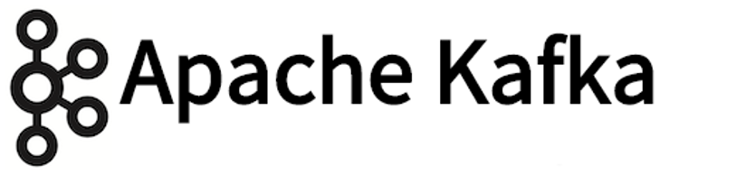

# Sistemas de mensajería. Apache Kafka



## 1. Sistemas de mensajería

Un sistema de mensajería es una herramienta que se encarga de la **transferencia de datos entre aplicaciones**, de modo que éstas puedan centrarse en los datos sin preocuparse de cómo compartirlos.

Un sistema distribuido de mensajería se basa en la gestión de **colas de mensajes**. Los mensajes se ponen en cola **de forma asíncrona** entre las aplicaciones cliente y el sistema de mensajería. Las aplicaciones producen y consumen los datos según su funcionalidad.

Hay dos tipos de patrones de mensajería, de **punto a punto** y de *publicación-suscripción** (pub-sub). La mayoría de las herramientas de mensajería siguen el patrón publicación-suscripción. 

En los últimos años han ido apareciendo nuevas herramientas de mensajería de código abierto, como Apache **Kafka**, **RabbitMQ** o **NATS**, que incorporan importantes diferencias respecto a las herramientas clásicas.

Estas nuevas herramientas se encargan fundamentalmente de la ingesta y enrutamiento de datos, grandes cantidades de datos, dejando al margen otras funcionalidades como la inteligencia de negocio. Son generalmente ligeras, pero también desplegables en configuraciones de alta disponibilidad. El receptor de los mensajes debe implementar la inteligencia sobre los datos recibidos.

**Apache Kafka**

Kafka es un motor de mensajería que puede realizar procesamiento tanto en tiempo real como por lotes. Puede persistir una gran cantidad de datos y soporta escenarios de "repetición". Su arquitectura es única: los topics se organizan en particiones (para paralelismo) y las particiones se replican entre nodos (para alta disponibilidad).

**RabbitMQ**

RabbitMQ es un motor de mensajería que puede almacenar los datos en memoria RAM, en disco o en ambos. Es compatible con una variedad de paradigmas de enrutamiento de mensajes y puede desplegarse para funcionar en alta disponibilidad. Su consola de administración es sencilla y fácil de usar.

**NATS**

NATS es un motor de mensajería de alta velocidad. Fue construido originalmente con Ruby y logró alcanzar los 150k mensajes por segundo. Reescrito en Go, ahora puede alcanzar del orden de 8 a 11 millones de mensajes por segundo. NATS no persiste los mensajes, si no está conectado simplemente no los recibe. Se protege de manera agresiva, purgando los consumidores desconectados. Es pequeño, una imagen de NATS en Docker apenas ocupa 3MB.

## 2. Kafka

Apache Kafka es un sistema de mensajería publicador-suscriptor con almacenamiento distribuido, particionado y replicado, muy rápido en lecturas y escrituras, características éstas que lo convierten en una excelente herramienta para comunicar streams de información que se generan a gran velocidad y que deben ser gestionados por una o varias aplicaciones.

Kafka está escrito en Scala y Java. Fue creado por LinkedIn, en 2011 se convirtió en un proyecto de código abierto y en 2012 en un proyecto Apache.

Kafka se puede utilizar en una organización para recopilar registros de múltiples servicios y ponerlos a disposición de múltiples consumidores en un formato estándar.


## 3. Kafka: características más destacadas

Algunas de las características más destacadas de Kafka son:

- Funciona como un servicio de mensajería.
- Los mensajes se categorizan en topics.
- Los mensajes se persisten en disco y se replican dentro del clúster para evitar la pérdida de datos. 
- Los procesos que publican se denominan brokers y los consumidores de los topics suscriptores.
- Cada broker mantiene un conjunto de particiones (primaria y secundaria) de cada topic.
- Se pueden programar productores/consumidores en muchos lenguajes: Java, Scala, Python, Ruby, C++ ...
- Es muy rápido, puede llegar a realizar 2 millones de escrituras por segundo, y garantiza cero tiempo de inactividad y pérdida de datos. 
- Mantiene un rendimiento estable incluso con muchos TB de mensajes almacenados. 
- Escala fácilmente y sin tiempo de inactividad.
- Es tolerante a fallos.

Kafka garantiza que:
- Los mensajes enviados por un productor a una partición de un topic se anexarán en el mismo orden en el que se envíen, es decir, si un mismo mensaje es enviado dos veces por el mismo productor, como M1 y M2, y M1 es enviado en primer lugar, entonces M1 se almacenará y aparecerá antes en el registro.
- Los consumidores ven los mensajes en el mismo orden en que se almacenan en el registro.
- Un topic con factor de replicación N tolera fallas de servidor de hasta N-1 sin perder ningún mensaje comprometido en el registro.

## 4. Kafka: casos de uso

Kafka puede utilizarse en numerosos casos de uso. Algunos de ellos:

- **Servicios de mensajería**: Kafka puede sustituir a otros sistemas de mensajería más tradicionales. En comparación con la mayoría de éstos, Kafka presenta un mejor rendimiento, particionamiento, replicación y tolerancia a fallos..., lo que la convierte en una buena solución para aplicaciones de procesamiento de mensajes a gran escala. Kafka es comparable a sistemas de mensajería tradicionales como ActiveMQ o RabbitMQ.

- **Seguimiento de la actividad de sitios web**: El seguimiento de la actividad de un sitio web suele generar un volumen de información muy grande, ya que se generan muchos mensajes con cada vista de página de usuario. Kafka puede realizar el seguimiento de actividad de usuario mediante un conjunto de feeds de publicación-suscripción en tiempo real, proporcionando procesamiento en tiempo real, monitorización en tiempo real y carga en sistemas de almacenamiento de datos como Hadoop para procesamiento y generación de informes offline.

- **Métricas**: Kafka se utiliza a menudo para monitotizar datos operacionales, agrupando estadísticas de aplicaciones distribuidas para producir feeds centralizados.

- **Agregación de logs** (trazas operacionales): Kafka es también muy utilizado como solución de agregación de logs, es decir, para recoger archivos de logs de los servidores y colocarlos en un repositorio central (por ejemplo un servidor de archivos HDFS) para su procesamiento. Kafka permite un procesamiento de baja latencia y un soporte más fácil para múltiples fuentes de datos y consumo de datos distribuidos. Kafka ofrece un rendimiento igual de bueno que Scribe o Flume, mejores garantías de durabilidad debido a la replicación y mucha menor latencia de extremo a extremo.

- **Procesamiento en streaming**: Muchos de los casos de uso de Kafka son procesos que constan de varias etapas, en las que los datos con sus topics van pasando de unas a otras enriqueciéndose en cada una de ellas y transformándose en nuevos topics que, a su vez, pueden ser consumidos por otras etapas y procesos. Desde la versión 0.10.0.0 Apache Kafka cuenta con una librería de procesamiento de streaming ligera pero potente llamada Kafka Streams. Otras herramientas que de procesamiento de streaming en código abierto son Apache Storm y Apache Samza.

- **Generación de eventos**: El soporte de Kafka para grandes volúmenes de logs hace que sea una excelente herramienta para aplicaciones en las que los cambios de estado se registran como una secuencia de registros ordenada en el tiempo.

- **Registro de confirmación (commit-log)**: Kafka puede servir como una especie de commit-log externo en un sistema distribuido. La replicación de datos entre los nodos actúa como mecanismo de re-sincronización para que los nodos fallidos restauren sus datos. En este uso, Kafka es similar al proyecto Apache BookKeeper.

## 5. Kafka: fundamentos

El diagrama siguiente ilustra los principales términos usados en Kafka:


Un **topic** (tema) es un flujo de mensajes que pertenecen a una categoría en particular. Los datos se almacenan en topics y los topics se dividen en **particiones**.

Las **réplicas** son "copias de seguridad" de una partición, no se utilizan para leer o escribir datos sino para evitar pérdida de datos.

Los **brokers** (publicadores) son los responsables del mantenimiento de los datos publicados. Cada broker puede tener cero o más particiones por tema.

Los **producers** (productores) editan mensajes de uno o más topics y los envían a los brokers de Kafka.

Los **consumers** (consumidores) se suscriben a uno o más topics y leen los datos de los brokers.

Un **clúster Kafka** incluye varios brokers. Un clúster de Kafka se puede ampliar sin tiempo de inactividad.

Un **leader** (líder) es el nodo responsable de todas las lecturas y escrituras para una partición determinada. Cada partición tiene un servidor líder.

Un **follower** (seguidor) es un nodo que sigue las instrucciones del líder. Si el líder falla, uno de los seguidores se convertirán automáticamente en el nuevo líder.


## 6. Kafka: brokers

Los brokers son los responsables del mantenimiento de los datos publicados. Cada broker puede tener cero o más particiones por tema.

Las particiones del registro se distribuyen a través de los servidores del clúster Kafka con cada servidor que maneja los datos y las solicitudes de una parte de las particiones. Cada partición se replica a través de un número configurable de servidores para tolerancia a fallos.

Cada partición tiene un servidor que actúa como el "líder" y cero o más servidores que actúan como "seguidores". El líder maneja todas las peticiones de lectura y escritura de la partición mientras los seguidores replican el líder de forma pasiva. Si el líder falla, uno de los seguidores se convertirá automáticamente en el nuevo líder. Cada servidor actúa como un líder para algunas de sus particiones y un seguidor para otros, por lo que la carga está bien equilibrada dentro del clúster.

## 7. Kafka: producers

Los productores publican los datos en los topics de su elección. El productor es responsable de elegir qué registro asignar a qué partición dentro del topic. Esto se puede hacer de una manera round-robin simplemente para equilibrar la carga o puede hacerse de acuerdo con alguna función de partición semántica (por ejemplo basada en alguna clave del registro).

## 8. Kafka: consumers

Los consumidores se autoetiquetan con un nombre de grupo de consumidores y cada registro publicado en un topic se envía a una instancia de consumidor dentro de cada grupo de consumidores suscriptores. Las instancias de consumidor pueden estar en procesos separados o en máquinas separadas.

Si todas las instancias de consumidor tienen el mismo grupo de consumidores, entonces los registros serán efectivamente balanceados de carga sobre las instancias de consumidor.

Si todas las instancias del consumidor tienen diferentes grupos de consumidores, cada registro se transmitirá a todos los procesos del consumidor.

Un clúster de dos servidores Kafka que aloja cuatro particiones (P0-P3) con dos grupos de consumidores. El grupo de consumidores A tiene dos instancias de consumidores y el grupo B tiene cuatro.

Más comúnmente, sin embargo, hemos encontrado que los topics tienen un pequeño número de grupos de consumidores, uno para cada "suscriptor lógico". Cada grupo está compuesto de muchas instancias de consumidor para escalabilidad y tolerancia a fallos. Esto no es más que publicar-subscribe la semántica donde el suscriptor es un racimo de consumidores en vez de un solo proceso.

La manera en que se implementa el consumo en Kafka es dividiendo las particiones en el registro sobre las instancias de consumidor para que cada instancia sea el consumidor exclusivo de una "parte justa" de particiones en cualquier momento. Este proceso de mantener la pertenencia al grupo es manejado dinámicamente por el protocolo de Kafka. Si las nuevas instancias se unen al grupo, se encargarán de algunas particiones de otros miembros del grupo; Si una instancia muere, sus particiones serán distribuidas a las instancias restantes.

Kafka sólo proporciona un orden total sobre registros dentro de una partición, no entre particiones diferentes en un topic. La ordenación por partición combinada con la capacidad de particionar datos por clave es suficiente para la mayoría de las aplicaciones. Sin embargo, si necesita un pedido total sobre registros, esto puede lograrse con un topic que tenga sólo una partición, aunque esto sólo significará un proceso de consumidor por grupo de consumidores.

## 9. Kafka: Instalación y operaciones básicas

- Instalar Kafka:
	```
	wget http://apache.rediris.es/kafka/0.10.2.0/kafka_2.11-0.10.2.0.tgz
	tar -xzf kafka_2.11-0.10.2.0.tgz
	```

- Instalar Zookeeper:
	```
	sudo apt-get update
	sudo apt-get install zookeeper-bin
	```

- Iniciar los servidores Zookeeper y Kafka
	```
	cd kafka_2.11-0.10.2.0
	bin/zookeeper-server-start.sh config/zookeeper.properties
	bin/kafka-server-start.sh config/server.properties
	```

- Iniciar un broker:
	```
	cd kafka_2.11-0.10.2.0
	bin/kafka-topics.sh --create --zookeeper localhost:2181 --replication-factor 1 --partitions 1 --topic test
	```

- Enviar mensajes (producer):
	```
	cd kafka_2.11-0.10.2.0
	bin/kafka-console-producer.sh --broker-list localhost:9092 --topic test
	```

- Consumir mensajes (consumer):
	```
	cd kafka_2.11-0.10.2.0
	bin/kafka-console-consumer.sh --bootstrap-server localhost:9092 --topic test --from-beginning
	```

## 10. Referencias

- Apache Kafka:
    - http://kafka.apache.org/

- Tutorial Apache Kafka:
    - http://www.w3ii.com/es/apache_kafka/apache_kafka_basic_operations.html

- Primeros pasos con Apache Kafka:
    - https://www.adictosaltrabajo.com/tutoriales/kafka-logs/

- Monitorización de Apache Kafka:
    - https://www.adictosaltrabajo.com/tutoriales/kafka-web-console/

- Modern Open Source Messaging: Apache Kafka, RabbitMQ and NATS in Action:
    - https://seroter.wordpress.com/2016/05/16/modern-open-source-messaging-apache-kafka-rabbitmq-and-nats-in-action/

- Apache Kafka basic training (V.0.8):
    - http://www.slideshare.net/miguno/apache-kafka-08-basic-training-verisign
